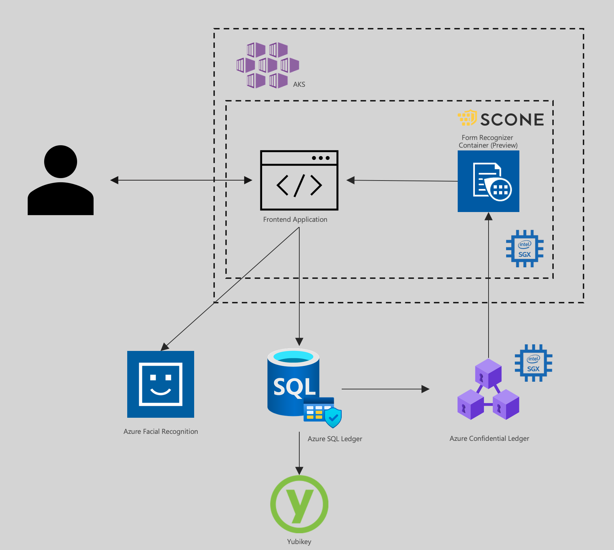

# emtech-confidential-compute

   

## Overview

This repository showcases Avanade's exploration with Confidential Computing on Azure, built around a document annotation scenario.

### Licensing

emtech-confidential-compute is available under the [MIT Licence](./LICENCE).

### Solutions Referenced

- [Azure Confidential Ledger](https://azure.microsoft.com/en-us/services/azure-confidential-ledger/)
- [Confidential computing nodes on Azure Kubernetes service](https://docs.microsoft.com/en-us/azure/confidential-computing/confidential-nodes-aks-overview?WT.mc_id=AI-MVP-5004204)
- [Azure Form Recognizer](https://docs.microsoft.com/en-us/azure/applied-ai-services/form-recognizer/?WT.mc_id=AI-MVP-5004204)

### Architecure

A high level Architecture of the proposed solution

This demonstrates how to use Azure confidential ledger to annotate a document while preserving the confidentiality of the document contents, checking people are authorised to access the documents, and processing in main memory. We explore how Microsoft’s Form recogniser can be run in a TEE, and utilise services like SQL Ledger and Azre Confidential Ledger to securely track all of the data.

### Documentation

The `docs` folder contains more detailed documentation.

Feel free to contact the team on Twitter, either [Chris](https://twitter.com/sealjay_clj) or [Fergus](https://twitter.com/FergusKidd). For bugs, please [raise an issue on GitHub](https://github.com/Avanade/emtech-distributed-data/issues).

## Contributing

Contributions are welcome. See information on [contributing](CONTRIBUTING.md), as well as our [code of conduct](CODE_OF_CONDUCT.md).
